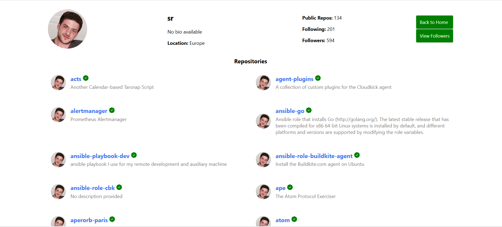
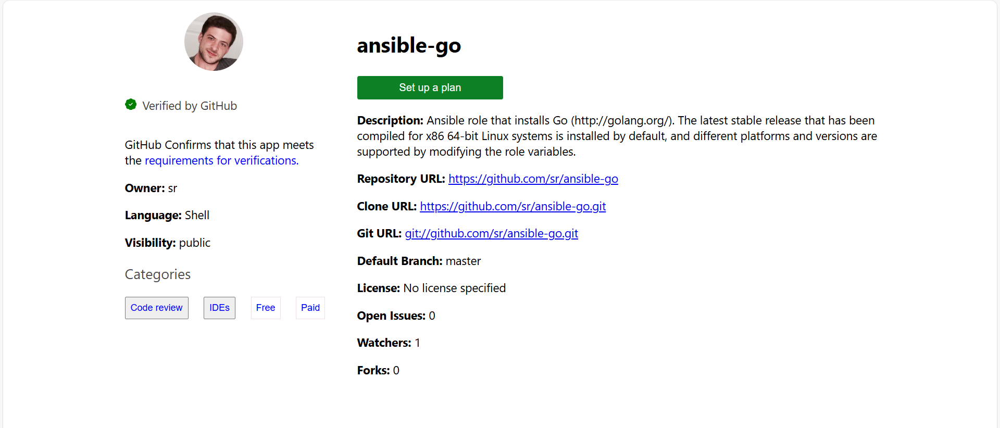
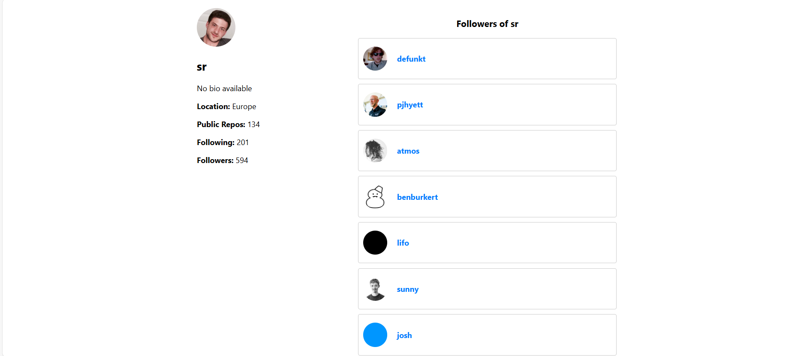
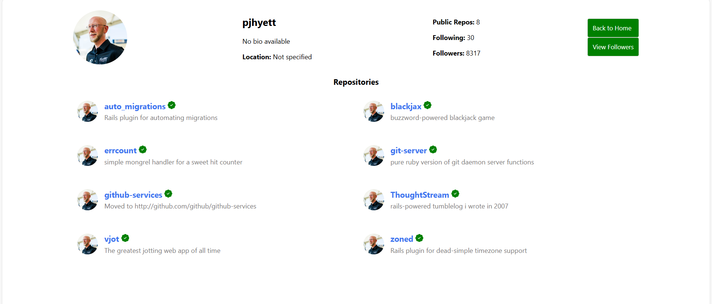

# Gitify
Gitify is a React-based web application that replicates some features of GitHub, allowing users to search for profiles with help of username, view repositories, and explore followers.

## Features

# Search User
- An initial page with a input box that accepts a GitHub username and a submit/search button.

# User Profiles
- Fetch and display user data with help of username, including avatar, bio, location, followers, and repositories.
- View a list of repositories for any GitHub user.
- Navigate to repository details.

# Repository Details
- On clicking any of the repositories, it will take us to a page which shows description about that repository.

# Followers List
- Display followers for any user.

- Click on a follower to view their repository list.

# Navigation
- Dynamic routing using React Router for seamless navigation.

## Tech Stack
- Frontend: React.js, Redux, React Router, CSS, HTML, JavaScript, Axios
- Backend: Node.js, Express.js, MongoDB, Mongoose

## Deployment
- Frontend deploy link: https://gitify-gamma.vercel.app
- Backend deploy link: https://gitify.onrender.com